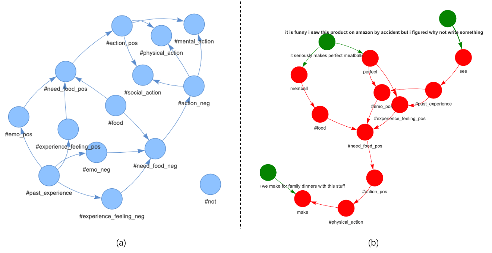

# MEA-DAG
We present a framework to reveal relationships among **motivations**, **emotions** and **actions** explicitly by **directed acyclic graphs** (MEA-DAG) given natural language texts.

Core features include Nature Design and Nurture Belief.
- Nature Design: Reveals the interactive mechanism among motivations, emotions and actions in human’s nature, being formed through thousands of years of genetic evolution. Note that only the motivation of human’s need for food is focused. **Figure (a)** shows the directed graph in inactive states.
- Nurture Belief: Nurture Belief connects outside world events and Nature Design. It is stored as tuples, e.g. ("meatball", #food). We build it by WordNet, SentiWordNet and LLM automatically.

**Figure (b)** shows an example of MEA-DAG given a piece of review: *It is funny I saw this product on amazon by accident but I figured why not write something. It seriously makes perfect meatballs. We make for family dinners with this stuff.*
- *It is funny I saw this product on amazon*: "saw" --> #past_experience
- *It seriously makes perfect meatballs*: (1) “meatball” --> #food (2) “perfect” --> #emo_pos
- #food, #emo_pos --> #need_food_pos --> #action_pos
- *We make for family dinners with this stuff*: “make” <-- #physical_action

`main.ipynb` is a demo for MEA-DAG. 

More details can be found in the [paper](https://arxiv.org/abs/2408.00966).

[//]: # ()


## Prerequisites
### ASER
1. Install `ASER` according to [official instructions](https://hkust-knowcomp.github.io/ASER/html/tutorial/get-started.html)
2. Run a `ASER` server locally.
```shell
cd ASER-master

nohup aser-server -n_workers 1 -n_concurrent_back_socks 10 \
    -port 8000 -port_out 8001 \
    -corenlp_path "source/stanford-corenlp-3.9.2" -base_corenlp_port 9000 \
    -aser_kg_dir "demo" -concept_kg_dir "demo/concept" -probase_path "data-concept-instance-relations.txt" > out.log &

```
### Python
Python Version = 3.9.6
```python
pip install -r requirements.txt
```

## Reference
If you find this work useful, please cite the following paper:
```
@article{Yang2024AutomaticEO,
  title={Automatic Extraction of Relationships among Motivations, Emotions and Actions from Natural Language Texts},
  author={Fei Yang},
  journal={ArXiv},
  year={2024},
  volume={abs/2408.00966}
}
```

